This article documents my attempt at this [issue or task](https://forge.fedoraproject.org/commops/interns/issues/122).

The issue description divides the task into **5** steps:

1. Install docling with your python package manager
2. Display the version of docling installed
3. Use the Docling CLI to convert a PDF (such as this one) with the default options
4. 
5. Try a different output format, such as html
6. Try a couple of other command line options to compare results 

##  My OS information:
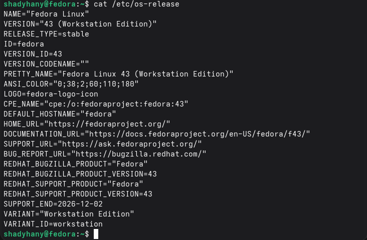

## Step 1: Installation & Verification

I verified Python and pip:

```bash
shadyhany@fedora:~$ python --version && pip --version
Python 3.14.3
pip 25.1.1 from /usr/lib/python3.14/site-packages/pip (python 3.14)
```

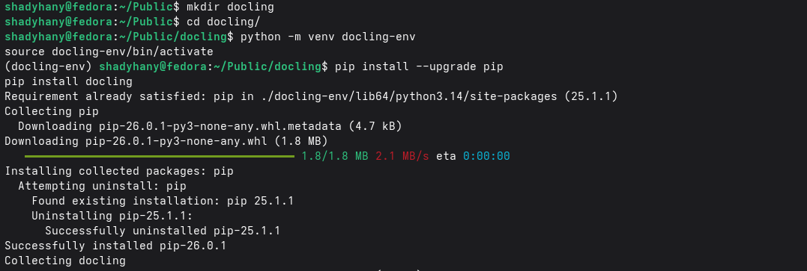


I then created a virtual environment to keep the project isolated and activated the venv:

```bash
shadyhany@fedora:~/Public/docling$ python3 -m venv docling-env
shadyhany@fedora:~/Public/docling$ source docling-env/bin/activate
(docling-env) shadyhany@fedora:~/Public/docling$
```

I then installed docling using pip:

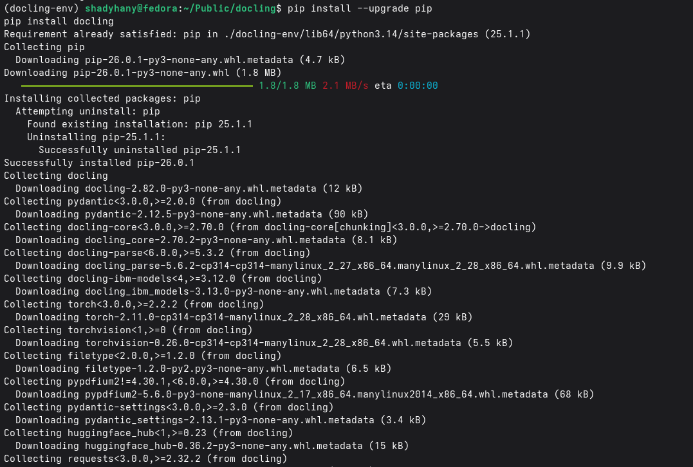

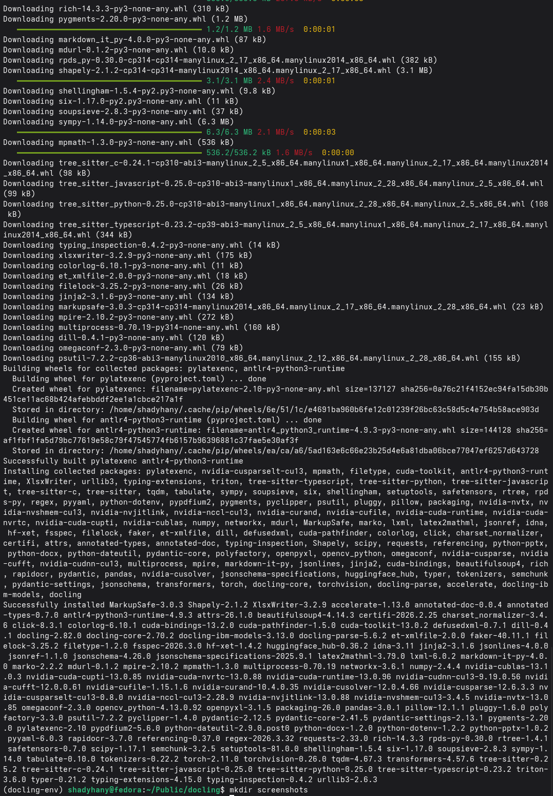


I also ran docling help to have a short tutorial and see how it works:
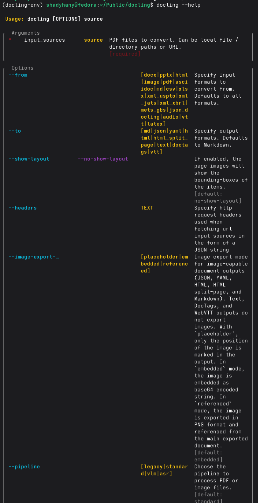

## Step 2: Version Information
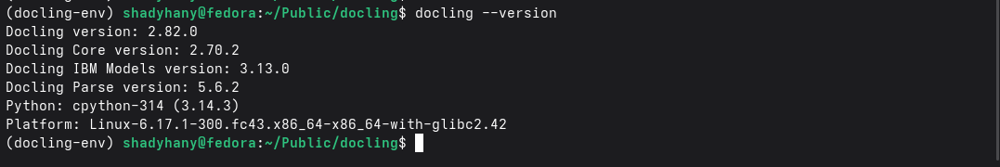


## Step 3: **Default** Markdown Conversion

### Command:

```bash
docling sponsor_pytconf26_eu_030526.pdf
```

### output:
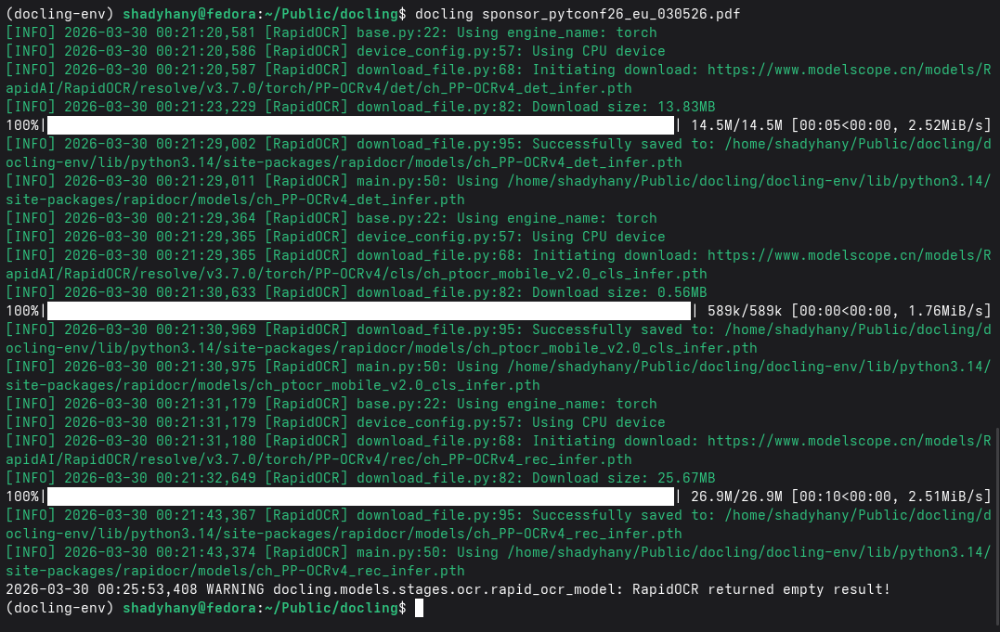

[The Output defaults to this .md file](sponsor_pytconf26_eu_030526.md)

- Overall, Docling handled the conversion smoothly. The resulting `.md` file preserved the document's structure, including sections and tables. Key information such as event dates, sponsorship tiers, and contact details were accurately extracted. 
- The conversion took about 2 minutes.
- It missed some subtle alignment issues within the document, such as failing to allocate icon images to relevant text:

**Output:**

### **output `.md` file**:
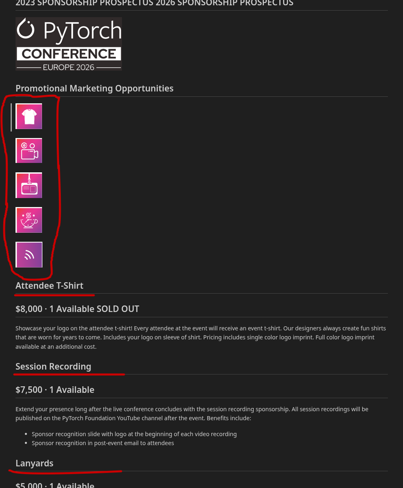


### **Source `.pdf` file**:


## Step 4: HTML Conversion

### Command
```bash
docling sponsor_pytconf26_eu_030526.pdf --to html
```

### Output Details
- **File Size:** 1.2M
- **Lines of Code:** 277
- **Processing Time:** ~3 minutes (cached models)
- **Terminal Output:**
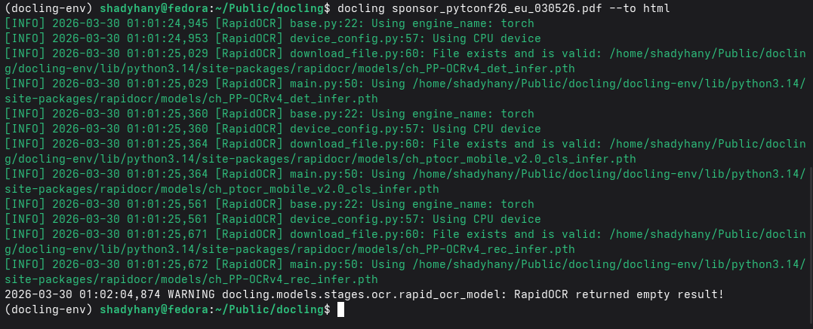

- **[output file](sponsor_pytconf26_eu_030526.html)**

### Key Observations
✅ **Successful Conversion**
- The `html` format appears the same as the `.md` one, with the same text-vs-icons alignment issues.

---

# Step 5: Alternative Options Tested

## 1. JSON Format Conversion

I tested the JSON format as a "lossless" representation, as it extracts metadata and structural relationships between document objects. The JSON format provides a geometric view of the document blocks. This format has high RAG support because JSON preserves the spatial information of the document, unlike simpler text formats like Markdown and HTML.

```bash
docling sponsor_pytconf26_eu_030526.pdf --to json
```

- **Output File:** [`sponsor_pytconf26_eu_030526.json`](sponsor_pytconf26_eu_030526.json)
- **Terminal Output:**
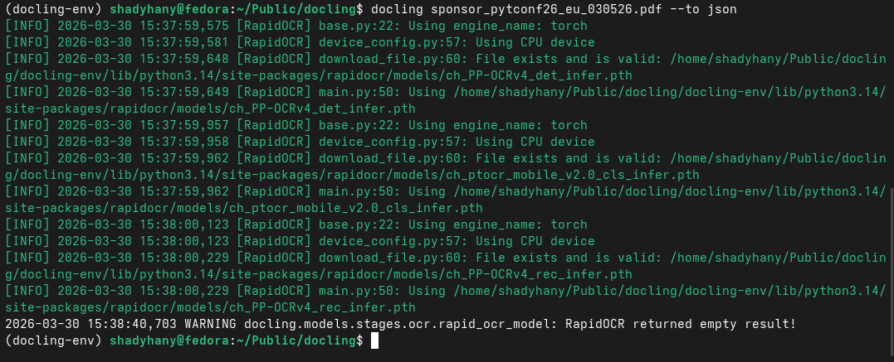

## 2. Accurate Table Mode (--table-mode accurate)

### Command

```bash
docling sponsor_pytconf26_eu_030526.pdf --table-mode accurate
```

### Terminal Output:
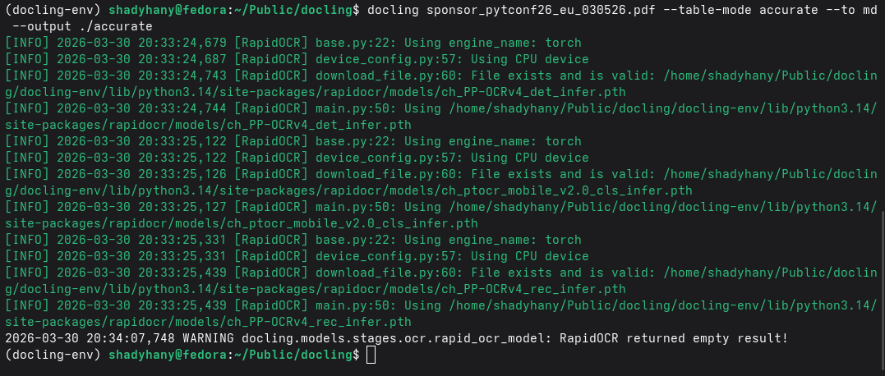

### Key Finding:
The output yielded an identical `.md` file because the default Docling pipeline already uses `--table-mode accurate` as the default setting.

## 3. Layout Analysis with Debug Visualization

### Command:

```bash
docling sponsor_pytconf26_eu_030526.pdf --to md --ocr --debug-visualize-layout --output ./docling_layout_analysis_report
```

### Output:

- **Terminal Output:**
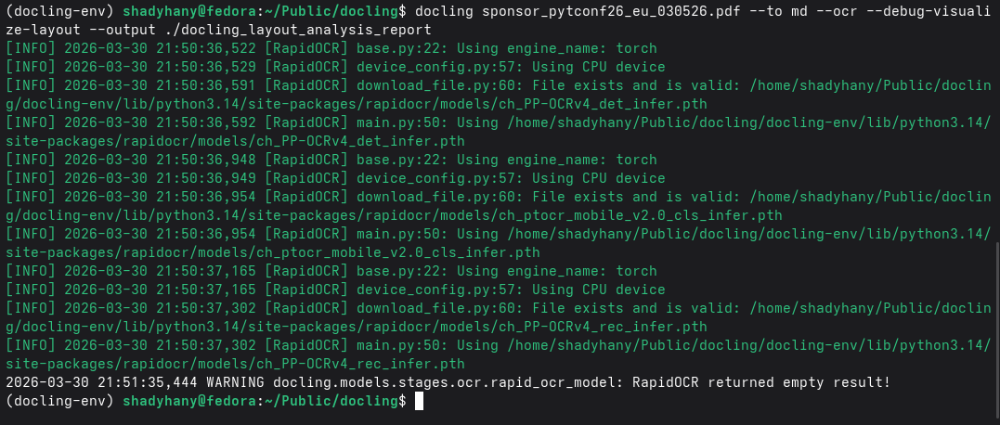

- The `.md` output file is identical to those generated by the default and `accurate` flags.

- It also generated a collection of images showing exactly how Docling "saw" the document. These visualizations show side-by-side comparisons of the original PDF page and Docling's interpretation, with boxes drawn around detected text and images. These visualization files were placed in the [`debug`](debug_output_images) folder. On page 2, the debug visualization was able to detect and box the "**PyTorch Conference 2024**" sign:
  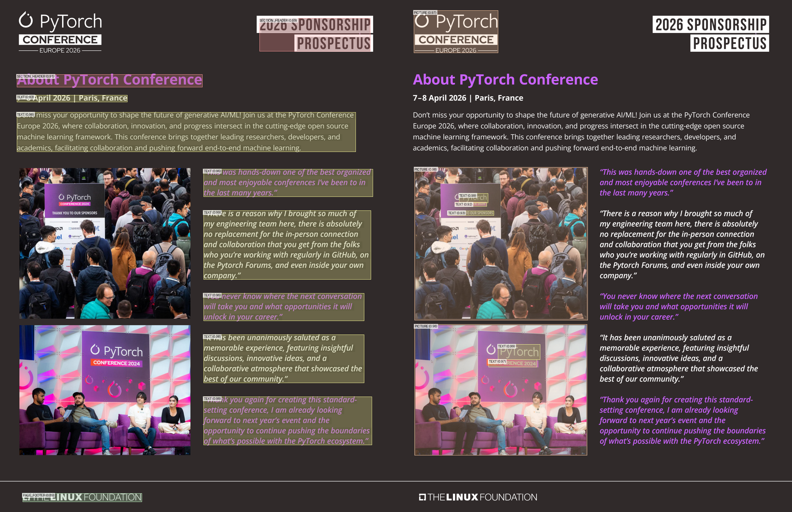

- Processing time: approximately 2 minutes (due to cached models)

---

## Project Files & Directories

This repository contains the following files and directories:

### Source Document
- **`sponsor_pytconf26_eu_030526.pdf`** - The original 7-page PyCon EU 2026 sponsorship prospectus used as the source document for all conversion tests.

### Conversion Outputs
- **`sponsor_pytconf26_eu_030526.md`** - Default markdown conversion output with full document structure and content.
- **`sponsor_pytconf26_eu_030526.html`** - HTML conversion output with embedded CSS styling for web viewing.
- **`sponsor_pytconf26_eu_030526.json`** - JSON structured output containing metadata, spatial relationships, and complete document hierarchy for programmatic processing.

### Test Outputs & Comparisons
- **`accurate/`** - Folder containing markdown output generated with explicit `--table-mode accurate` flag (produces identical results to default).
- **`docling_layout_analysis_report/`** - Output folder from the layout analysis command using OCR and debug visualization options.

### Visualizations & Screenshots
- **`debug_output_images/`** - Collection of layout analysis visualization images showing Docling's interpretation of document structure with bounding boxes around detected elements.
- **`terminal-screenshots/`** - Screenshots of terminal commands and output from each conversion step.
- **`document_imgs/`** - Additional images referenced in the documentation for comparison and analysis.

### Documentation
- **`README.MD`** - Complete guide documenting all steps, commands, outputs, and analysis of the Docling conversion testing.
